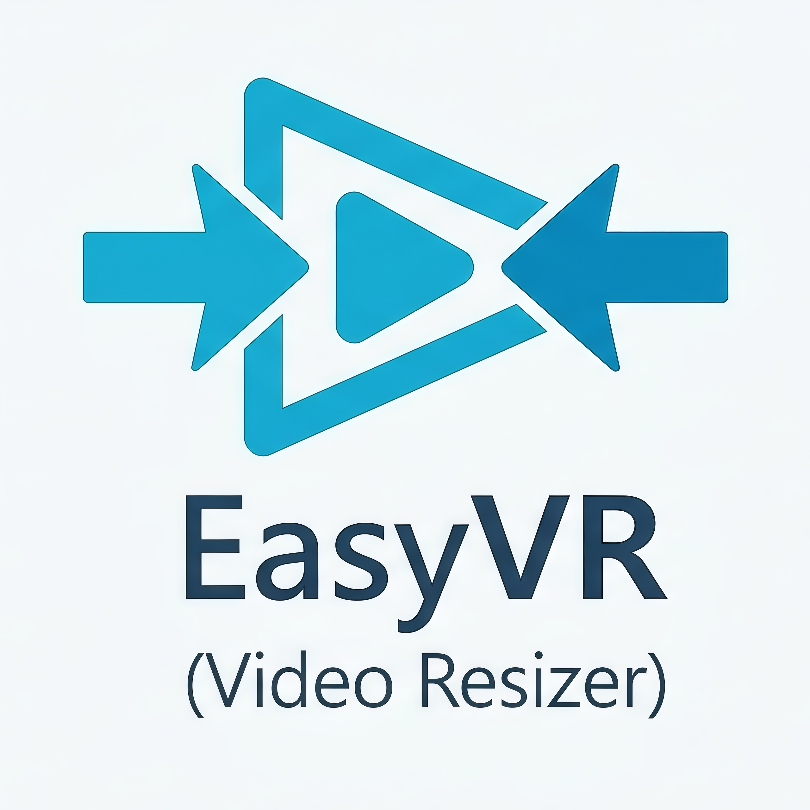

# EasyVR (Video Resizer)



Compress videos from the Windows right-click context menu with a modern WPF UI. Supports target file size, percentage compression, quality-based (CRF) encoding, resolution scaling, FPS adjustment, and codec selection.

## Features

- **3 compression modes**: Fixed Size (MB), Percent (%), Quality (CRF)
- **Resolution**: Downscale to 4K, 1080p, 720p, 480p, etc.
- **FPS**: Change frame rate (60, 30, 24, 15, 10)
- **Codecs**: H.264 (x264) or H.265 (x265/HEVC)
- **Presets**: Fast, Medium, Slow
- **Audio**: Keep original, re-encode AAC, or remove
- **Output**: MP4, MKV, or WebM
- **Silent**: No console window
- **Iterative**: Auto-adjusts bitrate to hit target size

## Installation

```powershell
.\install.ps1
```

The installer:
1. Copies FFmpeg to the local folder (or downloads it if not in PATH)
2. Registers **"EasyVR - Reduce Video Size"** in the right-click menu for `.mp4`, `.mkv`, `.avi`, `.mov`, `.webm`, `.wmv`, `.flv` and more

## Usage

1. Right-click a video -> **"EasyVR - Reduce Video Size"**
2. Choose compression mode:
   - **Fixed Size (MB)**: Enter target file size
   - **Percent (%)**: Slide to desired compression ratio
   - **Quality (CRF)**: Adjust quality slider (18=best, 28=smallest)
3. Expand **Advanced** to change resolution, FPS, codec, or audio
4. Click **COMPRESS VIDEO**
5. When done, the compressed file is saved next to the original

## Uninstall

```powershell
.\uninstall.ps1
```

## Requirements

- Windows 10/11
- PowerShell 5.1+
